# IoT CONTROL · 智能运维驾驶舱

<p align="center">

AI-powered IoT Operations Platform<br>
Digital Twin · Incident Intelligence · Knowledge Loop<br>
🚀 Portfolio Project · 2026

</p>

<p align="center">

**简体中文** | [English](README.en.md)

</p>

<p align="center">

**🌐 [在线预览](https://khalilyong221.github.io/iot-dashboard-demo/) ·
[3 分钟演示动线](https://khalilyong221.github.io/iot-dashboard-demo/demo.html)**

</p>

<p align="center">

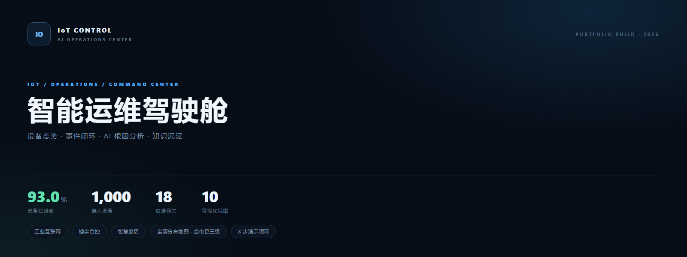

</p>

---

## 目录

- [Quick Start](#quick-start)
- [在线预览与入口页](#在线预览与入口页)
- [演示动线](#演示动线)
- [项目简介](#项目简介)
- [核心能力](#核心能力)
- [系统架构](#系统架构)
- [演示数据说明](#演示数据说明)
- [Demo Screenshots](#demo-screenshots)
- [技术栈](#技术栈)
- [项目结构](#项目结构)
- [后续路线](#后续路线)
- [Author](#author)

---

## Quick Start

无框架、无构建步骤的纯静态站点，克隆即可跑：

```bash
python -m http.server 8000
# 打开 http://127.0.0.1:8000/
```

也可以直接双击 `index.html` 浏览。不过工单与知识库依赖 `localStorage`，
以 `file://` 直接打开时部分浏览器会限制本地存储、导致跨页数据读不到，
**想完整走一遍闭环就用本地服务打开**。

第一次看建议从 [`demo.html`](https://khalilyong221.github.io/iot-dashboard-demo/demo.html) 进：
8 步带你从一台异常设备走到知识沉淀。

---

## 在线预览与入口页

**🌐 https://khalilyong221.github.io/iot-dashboard-demo/**

| 入口 | 页面 | 用途 |
|---|---|---|
| `index.html` | 智能运维驾驶舱 | 平台主入口：1,000 台设备态势、场景域切换、实时事件、今日运营快照、AI 运维助手 |
| `demo.html` | 从异常到知识：一条完整 IoT 运维闭环 | 3 分钟演示路线，顺着异常 → 诊断 → 工单 → 知识沉淀走一遍 |
| `iot-monitor-center.html` | 云枢 IoT · 设备监控中心 | 单页完整版监控中心，适合单独分享一条链接 |
| `pages/china-map.html` | 全国设备分布地图 | 中国地图按**省 / 市 / 县**三级下钻，1,000 台设备按行政区划铺开、按状态着色，点设备直达详情 |
| `pages/device-detail.html` | 设备详情 | 单台设备档案：实时参数、8 小时趋势、同站点 / 同网关双视角设备群、健康度、AI 诊断与一键生成工单 |
| `pages/user.html` | HomeFlow · 全屋智能（用户端） | 家庭视角的设备总览与场景联动：92 台设备 / 10 个房间 / 10 个一键场景 |
| `pages/portfolio.html` | 作品集页 | 把上面这些页面串成一份可分享的作品集 |

**深链**：设备相关页面都接受 `?device=<设备编号>`，可以直接把一台设备发给别人。例如
`index.html?device=IOT-0445#ai-section` 会打开该设备的数字档案并展开 AI 根因面板；
`pages/alerts.html?device=…` / `pages/topology.html?device=…` / `pages/maintenance.html?device=…`
分别落到事件上下文、影响范围与工单（`device-detail.html` 的主参数是 `?id=`，也兼容 `?device=`）。

**演示案例设备**：`demo.html` 的 8 步动线不写死设备编号，运行时从共享资产模型里挑一台
当前真正离线、且离线最久的设备。数据一改，动线自动跟着走，不会出现"跟着演示点进去，
打开的是一台健康设备"。

---

## 演示动线

`demo.html` 里的 8 步，每一步都对应一个真实页面与一条深链：

| # | 动作 | 落点 |
|---|---|---|
| 01 | 建立全局态势 | `index.html` |
| 02 | 在全国地图上定位 | `pages/china-map.html?scene=field` |
| 03 | 定位异常资产 | `index.html?device=…#devices` |
| 04 | 确认事件上下文 | `pages/alerts.html?device=…` |
| 05 | 让 AI 给出解释 | `index.html?device=…#ai-section` |
| 06 | 查看影响范围 | `pages/topology.html?device=…` |
| 07 | 进入现场处置 | `pages/maintenance.html?device=…&from=demo` |
| 08 | 完成后沉淀知识 | `pages/maintenance.html?device=…` |

---

## 项目简介

一个面向工业设备运维场景的 **IoT + AI 智能运营平台原型**，另含一条面向家庭用户的全屋智能用户端支线。

它要解决的不是"再加一块看板"，而是把传统设备监控往前推三步：**异常能解释、处置能闭环、经验能沉淀**。
所以除了设备态势，这里还有一条完整链路——离线设备 → AI 根因假设与证据链 → P1/P2 工单 →
处置结果写进知识库 → 下次诊断优先参考已被验证过的方案。

An enterprise-level IoT operations platform prototype: device monitoring, digital twin topology,
incident management, AI root-cause analysis and a maintenance knowledge loop — shipped as one static site
with no backend.

---

## 核心能力

| 模块 | 能力 | 入口 |
|---|---|---|
| 设备监控 | 1,000 台设备态势；按工业互联网 / 楼宇自控 / 智慧家居 / 全部设备切换场景域；实时事件流与运营快照 | `index.html` |
| 数字孪生拓扑 | 园区 → 区域 → 网关 → 设备四级资产树，与力导向图联动；节点检查器给出健康度、在线数、最近信号与影响范围 | `pages/topology.html` |
| 告警与事件 | 按风险分排序的事件上下文，可带 `?device=` 深链直接落到某台设备 | `pages/alerts.html` |
| AI 根因分析 | 根因假设按概率排序 + 置信度 + 证据链（RSSI / 温度 / 最后上报 / 健康度）；离线设备走链路排查分支 | `index.html#ai-section` |
| 工单与现场处置 | P1/P2 工单状态机（处理中 → 待验证 → 已完成），汇总累计单量、未关闭数与平均 MTTR | `pages/maintenance.html` |
| 知识闭环 | 处置结果（根因 / 方案 / 优先级 / 工时）写入知识库；AI 诊断时召回同区域、同根因的历史案例 | `pages/maintenance.html` |
| 运营分析 | 健康趋势、能耗、风险排行 | `pages/analytics.html` |
| 全国分布地图 | 省 / 市 / 县三级下钻，设备按状态着色，点设备直达详情 | `pages/china-map.html` |
| 设备档案 | 实时参数、8 小时趋势、同站点 / 同网关双视角设备群、健康度评分、AI 诊断、一键生成工单 | `pages/device-detail.html` |
| 全屋智能用户端 | 家庭视角：92 台设备 / 10 个房间 / 10 个一键场景，并汇总需要关注的设备异常 | `pages/user.html` |

---

## 系统架构

<p align="center">

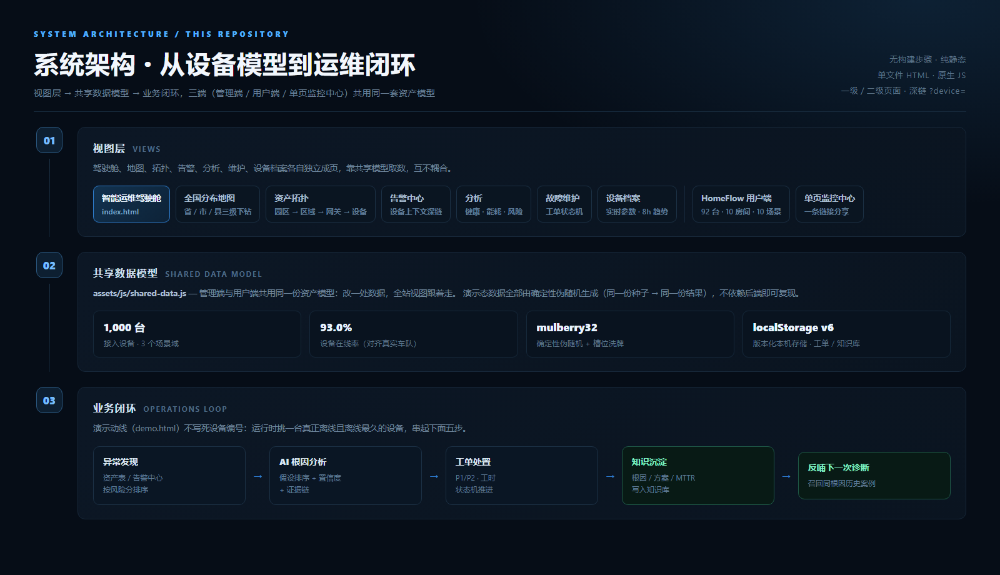

</p>

三个层次：视图层（三端共用一套页面）→ 共享数据模型 → 业务闭环。

```text
设备层
 ↓
IoT Gateway
 ↓
Telemetry Pipeline
 ↓
Operations Center
 ↓
AI Diagnosis Engine
 ↓
Knowledge Loop
```

---

## 演示数据说明

这是一个**无后端**的原型：设备、遥测与事件全部由 `assets/js/shared-data.js` 在浏览器里生成。
把它摊开讲，是因为这几处最容易被当成"随便编的假数据"：

- **确定性伪随机**：`mulberry32` + 槽位洗牌（`slotPool`）。同一份种子永远得到同一份结果，
  所以截图、演示、回归测试看到的都是同一批设备——不会出现"刷新一次全变了"。
- **在线率对齐真实车队**：工业域 930 在线 / 45 异常 / 25 离线（**93.0%**）。
  早期版本是 400 / 200 / 400 的四六开，跟真实车队的在线率差太远，已按真实水位调整。
- **型号 / 片区 / 状态相互独立**：早期三者由同一个 `index % 5` 步长推导，
  结果是"某个片区的设备全是同一个型号、且全部离线"。现在型号与状态各用一张独立槽位表打散，
  而总体比例保持不变（所以驾驶舱头条数字不会漂）。
- **AI 是规则驱动的推理链，不是大模型调用**：状态 / RSSI / 温度 / 网关关系 → 假设排序 + 置信度 +
  建议动作，再叠加知识库召回。这样每次结论都可复现、可解释。
- **本机存储**：设备模型（storageKey `v6`）、工单（`iot-work-orders-v2`）、
  知识库（`iot-knowledge-base-v2`）都写在 `localStorage`，清掉即回到初始演示态。

---

## Demo Screenshots

### IoT Operations Dashboard

1,000 台设备 / 93.0% 在线率，按工业互联网 · 楼宇自控 · 智慧家居 · 全部设备四个场景域切换；
园区设备态势图、实时事件流、设备资产表与今日运营快照都在同一屏内。

<p align="center">


</p>

### Digital Twin Topology

园区 → 区域 → 网关 → 设备四级资产树，与力导向拓扑图联动；右侧节点检查器给出
健康度、在线数与最近信号，底部是影响范围（Blast radius）说明。

<p align="center">

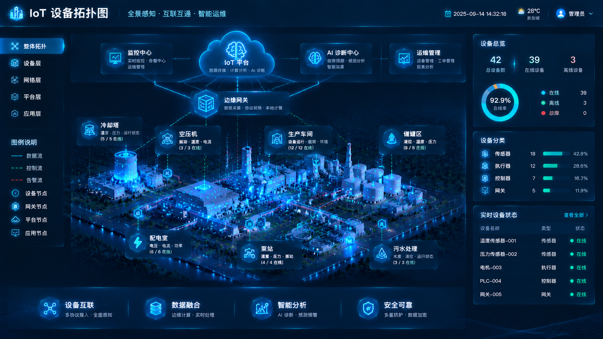

</p>

### AI Diagnosis Assistant

以一台真实离线设备为例：置信度 78%，三条根因假设按概率排序（网关侧连接中断 / 无线覆盖劣化 /
设备断电），配四条建议动作与证据链，并召回知识库中相同根因 1 起、历史平均 MTTR 14 min 的处置经验。

<p align="center">

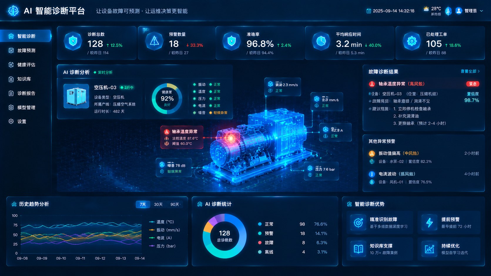

</p>

### Smart Home User Console

面向家庭用户的设备总览：92 台设备接入、10 个房间分区、能耗与空气质量速览。

<p align="center">

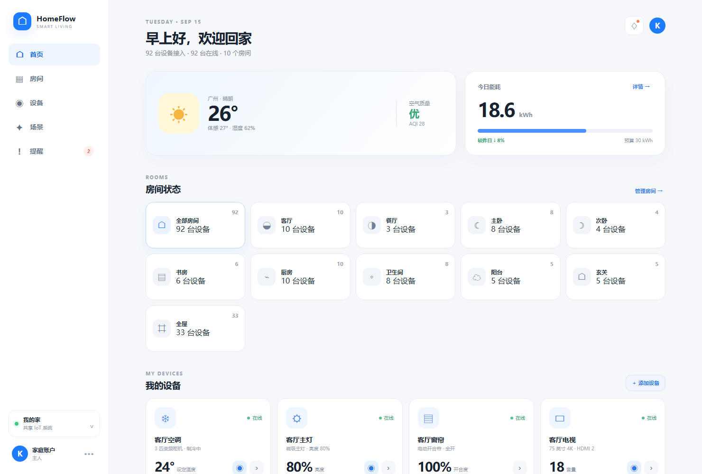

</p>

### One-tap Scenes & Cross-device Automation

10 个一键场景（回家 / 离家 / 晚安 / 观影 / 起床 / 会客 / 游戏 / 节能 / 烹饪 / 睡前阅读），
每个场景驱动多设备联动，并汇总需要关注的设备异常。

<p align="center">

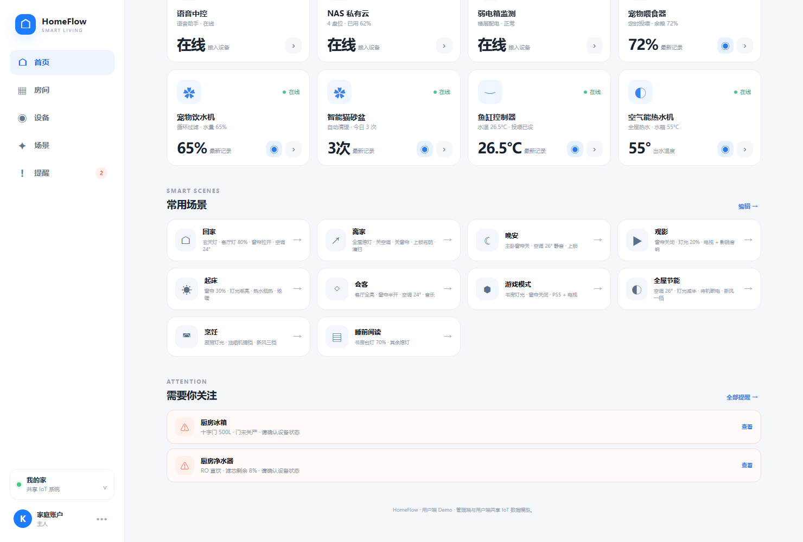

</p>

### Nationwide Device Map · Province / City / County Drill-down

把 1,000 台设备铺到中国地图上：全国视角按省份密度着色 + TOP 排行，
点省份进市级、点城市进区县，设备按在线 / 异常 / 离线三色散点呈现。

<p align="center">

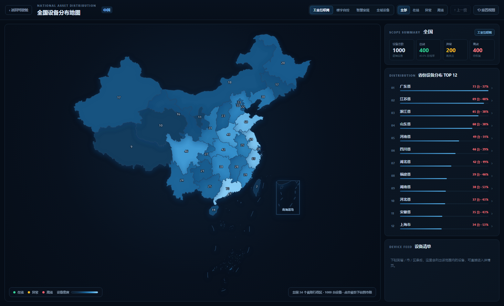

</p>

省级视图（以广东省为例）：21 个地市设备散点 + 城市排行 + 设备清单。

<p align="center">

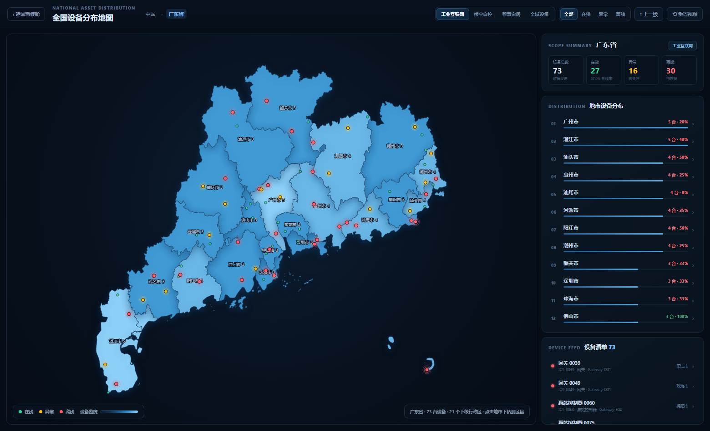

</p>

市 → 区县下钻（以广州市为例）：11 个区县设备归属一目了然。

<p align="center">

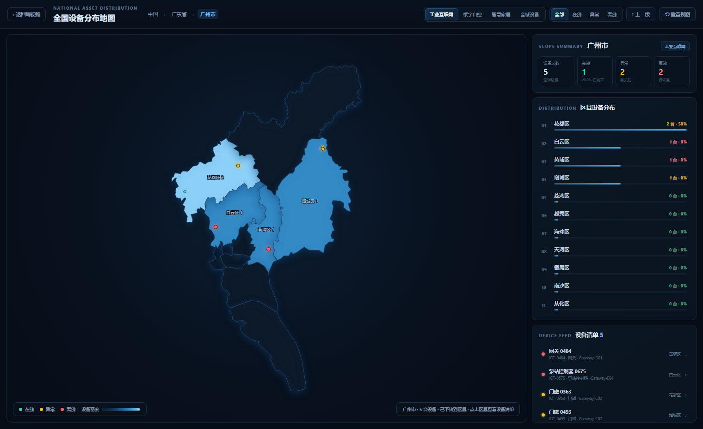

</p>

### Device Detail · From Map Pin to Asset

地图上任意设备可直接跳转详情：现场语义（园区 / 厂房 / 家庭）、实时参数、
8 小时趋势、同站点 / 同网关双视角设备群、健康度评分与 AI 诊断建议。

诊断结论按设备状态区分：离线给出故障原因与三步处置建议，状态异常提示
「仍在上报但通信质量下降」，运行正常则不再挂故障原因。任意设备可
**一键生成工单**，编号 / 日期 / 类型 / 负责人 / 工时进入本机工单履历，
并汇总累计单量、未关闭数与平均 MTTR。

<p align="center">

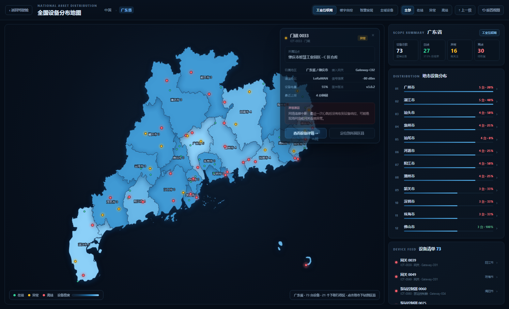

</p>

<p align="center">

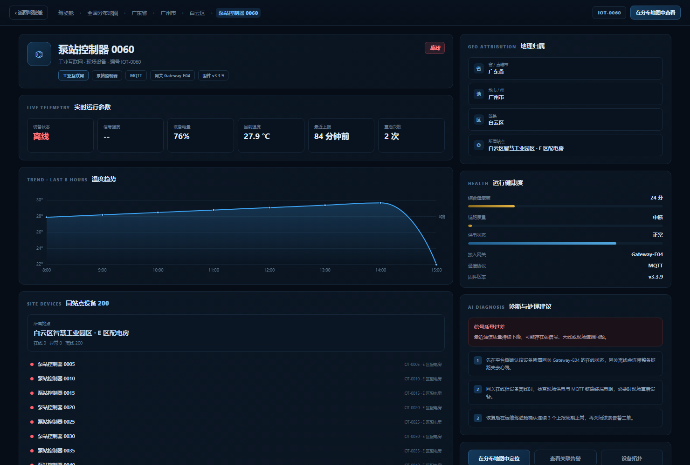

</p>

---

## 技术栈

- **前端**：HTML5 / CSS3 / 原生 JavaScript —— 无框架、无构建步骤，克隆即可运行
- **图表**：ECharts（全国分布地图、运营分析）
- **地图数据**：公开行政区划边界数据，抽稀后打成 35 个 `.js`（构建脚本见 `tools/build-geo.py`）
- **存储**：`localStorage`（设备模型 / 工单 / 知识库）
- **部署**：GitHub Pages

细节上：设备表行支持键盘 `Enter` / `Space` 打开档案，地图散点与关键按钮都带 `aria-label`；
配图（头图、架构图）由 `tools/` 下的 HTML 源文件配合无头 Chrome 截图生成，便于复现与修改。

---

## 项目结构

```text
iot-dashboard-demo
│
├── README.md                   中文版（默认渲染）
├── README.en.md                English version
│
├── index.html                  平台主入口 · 智能运维驾驶舱
├── demo.html                   3 分钟演示路线
├── iot-monitor-center.html     单页完整版监控中心
│
├── pages/                      功能页（每页自带 .css / .js）
│   ├── alerts.html             告警中心
│   ├── analytics.html          运营分析
│   ├── topology.html           数字孪生拓扑
│   ├── maintenance.html        工单与现场处置
│   ├── user.html               全屋智能用户端（92 台设备 / 10 场景）
│   ├── china-map.html          全国设备分布地图（省 / 市 / 县三级下钻）
│   ├── device-detail.html      设备详情（站点 / 家庭 / 厂房 + AI 诊断 + 工单履历）
│   └── portfolio.html          作品集页
│
├── assets/
│   ├── css/                    公共样式
│   │   ├── base.css            基础层（被 dashboard-v2.css @import）
│   │   ├── dashboard-v2.css    驾驶舱主题
│   │   ├── ai-operations.css   AI 助手面板
│   │   └── knowledge-loop.css  知识闭环
│   ├── js/                     公共脚本
│   │   ├── shared-data.js      设备数据模型（各页共用）
│   │   ├── dashboard-app.js    驾驶舱逻辑
│   │   ├── dashboard-enhance.js
│   │   ├── ai-operations.js    AI 运维分析
│   │   ├── knowledge-loop.js   知识闭环
│   │   └── iot-center.js       监控中心逻辑
│   ├── data/geo/               行政区划边界数据（35 个 .js，见 build-geo.py）
│   ├── vendor/echarts.min.js   图表库
│   └── img/                    README 配图
│
├── tools/
│   ├── build-geo.py            行政区划数据构建脚本（抓取 → 抽稀 → 打包）
│   ├── banner.html             README 头图源文件（无头 Chrome 截图生成 banner.png）
│   └── architecture.html       架构图源文件（同法生成 architecture.png）
│
├── docs/                       设计文档
│   ├── architecture.md
│   ├── ai-agent-comparison.md
│   └── development-log.md
│
└── screenshots/                README 截图
```

---

## 后续路线

- 接入真实 MQTT 上报与时序数据库，替换本地确定性数据
- 从"已发生"提前到"将发生"：预测性维护模型
- 3D 数字孪生可视化
- 多租户、角色与操作审计
- 从规则推理升级到可解释的模型辅助诊断

---

## Author

**Khalil Zheng** · IoT Project Manager

暖通智能化 / 物联网系统集成方向，项目管理背景。
本项目是个人作品集原型，数据仅用于演示。
