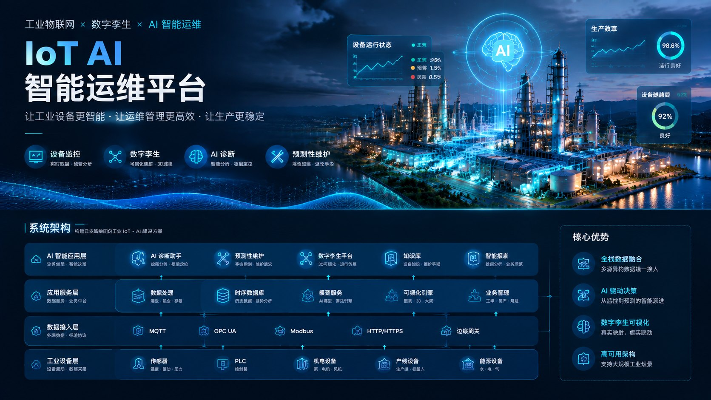
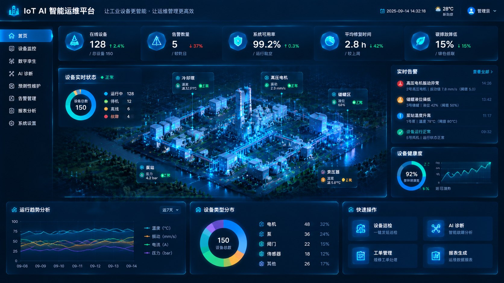
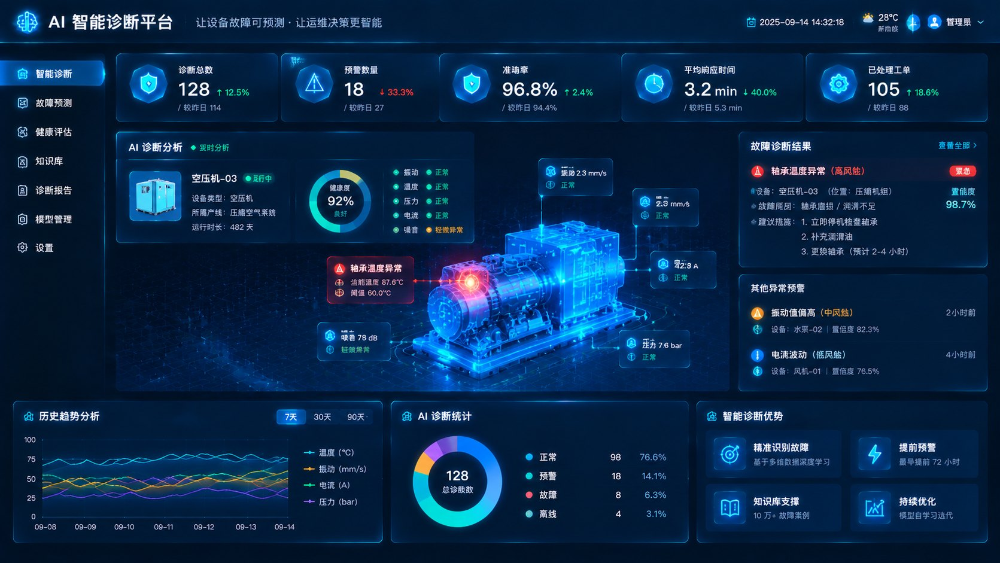
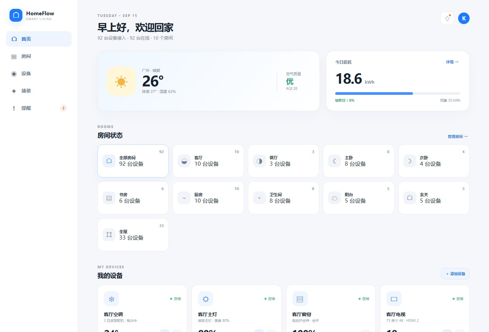
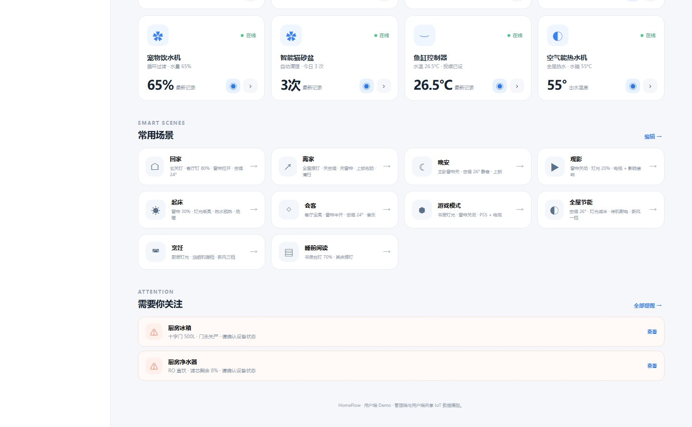
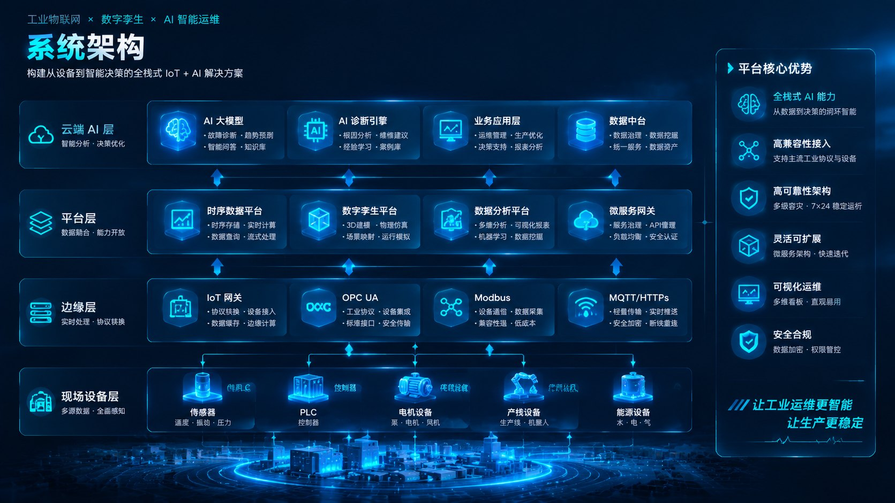

## IoT AI Operations Platform

<p align="center">

AI-powered Industrial IoT Operations Platform<br>
Digital Twin · Incident Intelligence · Predictive Maintenance

</p>

<p align="center">

🚀 Portfolio Project · 2026

</p>

<p align="center">



</p>

---

## Live Demo

**🌐 https://khalilyong221.github.io/iot-dashboard-demo/**

四个入口页，按用途分开：

| 入口 | 页面 | 用途 |
|---|---|---|
| `index.html` | 智能运维驾驶舱 | 平台主入口：设备态势、实时事件、健康趋势、AI 运维助手 |
| `demo.html` | 从异常到知识：一条完整 IoT 运维闭环 | 3 分钟演示路线，顺着异常 → 诊断 → 工单 → 知识沉淀走一遍 |
| `iot-monitor-center.html` | 云枢 IoT · 设备监控中心 | 单页完整版监控中心，适合单独分享一条链接 |
| `pages/user.html` | HomeFlow · 全屋智能（用户端） | 家庭视角的设备总览与场景联动：92 台设备 / 10 个房间 / 10 个一键场景 |

---

## Demo Screenshots

### IoT Operations Dashboard

<p align="center">



</p>

### Digital Twin Topology

<p align="center">


</p>

### AI Diagnosis Assistant

<p align="center">



</p>

### Smart Home User Console

面向家庭用户的设备总览：92 台设备接入、10 个房间分区、能耗与空气质量速览。

<p align="center">



</p>

### One-tap Scenes & Cross-device Automation

10 个一键场景（回家 / 离家 / 晚安 / 观影 / 起床 / 会客 / 游戏 / 节能 / 烹饪 / 睡前阅读），
每个场景驱动多设备联动，并汇总需要关注的设备异常。

<p align="center">



</p>

---

## Key Features

| Module | Capability |
|---|---|
| Device Monitoring | Real-time telemetry |
| Digital Twin | Asset topology visualization |
| AI Diagnosis | Root cause analysis |
| Maintenance | Knowledge loop |
| Smart Home Console | 92 devices · 10 scenes · cross-device automation |

---

## Project Overview

An enterprise-level IoT intelligent operations platform prototype.

The system integrates:

- Device monitoring
- Digital Twin visualization
- Incident management
- AI-assisted diagnosis
- Predictive maintenance
- Operation analytics

The goal is to transform traditional equipment monitoring into an AI-driven closed-loop operation system.

一个面向工业设备运维场景的 IoT + AI 智能运营平台，另含一条面向家庭用户的全屋智能用户端支线。

核心能力：

- 设备状态监控
- 数字孪生拓扑
- 异常检测
- AI 根因分析
- 智能工单
- 知识闭环

---

## System Architecture

<p align="center">



</p>

```text
设备层
 ↓
IoT Gateway
 ↓
Telemetry Pipeline
 ↓
Operations Center
 ↓
AI Diagnosis Engine
 ↓
Knowledge Loop
```

---

## Core Modules

1. Device Monitoring
2. Digital Twin
3. Incident Management
4. AI Diagnosis
5. Maintenance Workflow
6. Analytics

### 1. IoT Monitoring Center

Real-time equipment status visualization.

Capabilities:

- Device health monitoring
- Alarm detection
- Network status
- Operational KPI

### 2. Digital Twin Topology

Visual representation of:

- Factory area
- IoT gateway
- Device relationship
- Data flow

### 3. AI Diagnosis Engine

AI assisted fault analysis:

```text
Telemetry
    ↓
Pattern Recognition
    ↓
Root Cause Analysis
    ↓
Recommended Action
```

### 4. Intelligent Maintenance Workflow

```text
Incident
   ↓
Diagnosis
   ↓
Work Order
   ↓
Field Action
   ↓
Verification
   ↓
Knowledge Update
```

---

## Demo Scenario

A typical industrial IoT operation workflow:

1. Device abnormality detected
2. Alarm generated
3. AI analyzes possible causes
4. Maintenance task created
5. Repair result verified
6. Knowledge base updated

---

## Tech Stack

Frontend:

- HTML5
- CSS3
- JavaScript
- ECharts

AI Concept:

- Root Cause Analysis
- Knowledge Retrieval
- Predictive Maintenance

Deployment:

- GitHub Pages

---

## Project Structure

```text
iot-dashboard-demo
│
├── index.html                  平台主入口 · 智能运维驾驶舱
├── demo.html                   3 分钟演示路线
├── iot-monitor-center.html     单页完整版监控中心
│
├── pages/                      功能页（每页自带 .css / .js）
│   ├── alerts.html             告警中心
│   ├── analytics.html          运营分析
│   ├── topology.html           数字孪生拓扑
│   ├── maintenance.html        工单与现场处置
│   ├── user.html               全屋智能用户端（92 台设备 / 10 场景）
│   └── portfolio.html          作品集页
│
├── assets/
│   ├── css/                    公共样式
│   │   ├── base.css            基础层（被 dashboard-v2.css @import）
│   │   ├── dashboard-v2.css    驾驶舱主题
│   │   ├── ai-operations.css   AI 助手面板
│   │   └── knowledge-loop.css  知识闭环
│   ├── js/                     公共脚本
│   │   ├── shared-data.js      设备数据模型（各页共用）
│   │   ├── dashboard-app.js    驾驶舱逻辑
│   │   ├── dashboard-enhance.js
│   │   ├── ai-operations.js    AI 运维分析
│   │   ├── knowledge-loop.js   知识闭环
│   │   └── iot-center.js       监控中心逻辑
│   ├── vendor/echarts.min.js   图表库
│   └── img/                    README 配图
│
├── docs/                       设计文档
│   ├── architecture.md
│   ├── ai-agent-comparison.md
│   └── development-log.md
│
└── screenshots/                README 截图
```

---

## Future Roadmap

- AI Agent for autonomous diagnosis
- Real-time MQTT telemetry
- Digital Twin 3D visualization
- Predictive maintenance model
- Industrial knowledge graph

---

## Author

**Khalil** · IoT Product Manager
