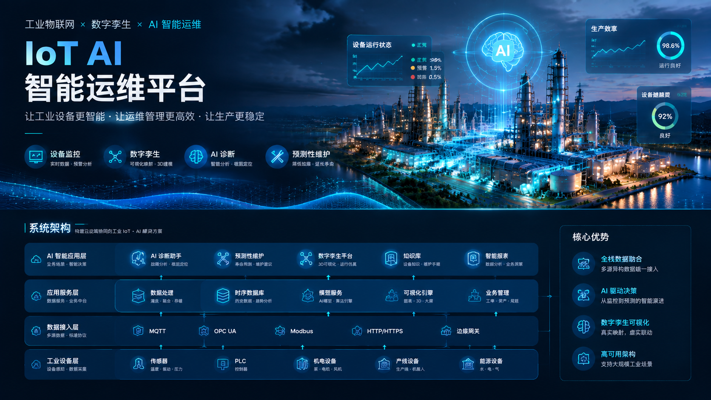
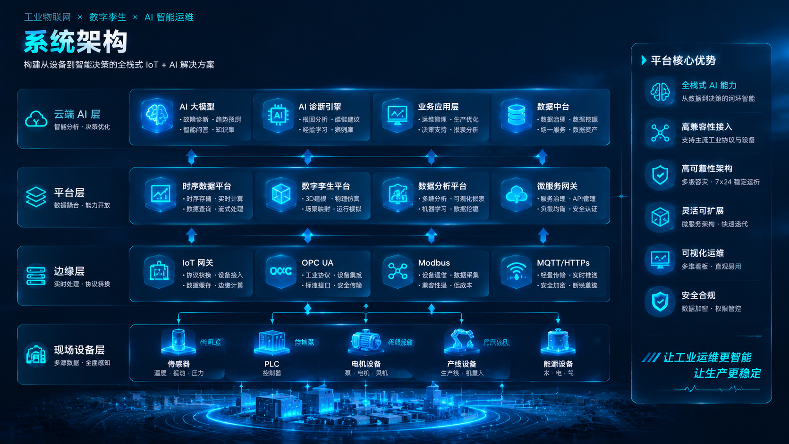

## IoT AI Operations Platform


<p align="center">

AI-powered Industrial IoT Operations Platform  
Digital Twin · Incident Intelligence · Predictive Maintenance  

</p>


<p align="center">

🚀 Portfolio Project · 2026

</p>


<p align="center">



</p>


---

## System Architecture


<p align="center">



</p>


---
<p align="center">

</p>

---

> Industrial IoT + AI Intelligent Operations Center  
> Portfolio Project · 2026

## Live Demo
---

## Demo Screenshots

### IoT Operations Dashboard

<p align="center">


</p>
### Key Features

| Module | Capability |
|---|---|
| Device Monitoring | Real-time telemetry |
| Digital Twin | Asset topology visualization |
| AI Diagnosis | Root cause analysis |
| Maintenance | Knowledge loop |
### Digital Twin Topology

<p align="center">


</p>

### AI Diagnosis Assistant

<p align="center">


</p>
🌐 Online:
https://khalilyong221.github.io/iot-dashboard-demo/
---

## Demo Screenshots

### Operations Dashboard


### Digital Twin Topology


### AI Diagnosis Center


## Project Overview

An enterprise-level IoT intelligent operations platform prototype.

The system integrates:

- Device monitoring
- Digital Twin visualization
- Incident management
- AI-assisted diagnosis
- Predictive maintenance
- Operation analytics


The goal is to transform traditional equipment monitoring into an AI-driven closed-loop operation system.


一个面向工业设备运维场景的 IoT + AI 智能运营平台。

核心能力：

设备状态监控
数字孪生拓扑
异常检测
AI根因分析
智能工单
知识闭环


## System Architecture

设备层
 ↓
IoT Gateway
 ↓
Telemetry Pipeline
 ↓
Operations Center
 ↓
AI Diagnosis Engine
 ↓
Knowledge Loop


## Core Modules

1. Device Monitoring
2. Digital Twin
3. Incident Management
4. AI Diagnosis
5. Maintenance Workflow
6. Analytics


## Tech Stack

Frontend:
- HTML5
- CSS3
- JavaScript
- ECharts

AI Concept:
- Root Cause Analysis
- Knowledge Retrieval
- Predictive Maintenance

Deployment:
- GitHub Pages


## Demo

Live:
https://khalilyong221.github.io/iot-dashboard-demo/


## Author

Khalil
IoT Product Manager
---

## Project Structure

```text
AIoT-Operations-Platform-V1

├── index.html
├── iot-monitor-center.html
├── demo.html

├── portfolio.html
│
├── assets/
│   └── charts
│
├── docs/
│   └── architecture.md
│
├── ai-operations/
│   ├── ai diagnosis
│   └── knowledge loop
│
├── topology/
│   ├── digital twin
│   └── device relationship
│
├── analytics/
│   ├── OEE
│   ├── MTBF
│   └── MTTR
│
├── maintenance/
│   ├── work order
│   └── field action
│
└── shared/
    └── common components
Product Highlights
1. IoT Monitoring Center

Real-time equipment status visualization.

Capabilities:

Device health monitoring
Alarm detection
Network status
Operational KPI
2. Digital Twin Topology

Visual representation of:

Factory area
IoT gateway
Device relationship
Data flow
3. AI Diagnosis Engine

AI assisted fault analysis:

Telemetry
    ↓
Pattern Recognition
    ↓
Root Cause Analysis
    ↓
Recommended Action
4. Intelligent Maintenance Workflow
Incident
   ↓
Diagnosis
   ↓
Work Order
   ↓
Field Action
   ↓
Verification
   ↓
Knowledge Update
Demo Scenario

A typical industrial IoT operation workflow:

Device abnormality detected
Alarm generated
AI analyzes possible causes
Maintenance task created
Repair result verified
Knowledge base updated
Future Roadmap
AI Agent for autonomous diagnosis
Real-time MQTT telemetry
Digital Twin 3D visualization
Predictive maintenance model
Industrial knowledge graph

---  